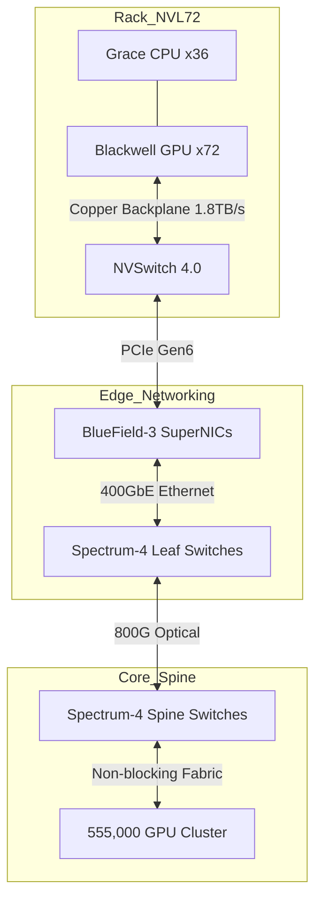

# xai-colossus-servers

> **GB200 Rack Topologies, NVLink Fabrics, and Density Optimization**

---

## 🛑 The Challenge: Scaling the Fabric

Wiring 555,000+ GPUs is not a server problem; it is a physics problem.
- **Copper Limits:** Traditional copper DAC cables cannot sustain signaling over 1 meter at 1.8 TB/s.
- **Topology Overheads:** Inefficient network topologies at this scale result in 30%+ latency overheads during distributed training.
- **Density:** Racks must be hyper-dense to minimize cable runs, creating massive structural and thermal loads.

---

## 🖥️ The Solution: Supermicro NVL72/144 Integration

This repository defines the physical architecture, cabling maps, and logical topologies for the Colossus 2 server fleet.

### 1. The Rack: GB200 NVL72
- **Compute:** 72 Blackwell GPUs and 36 Grace CPUs functioning as a single logical super-GPU.
- **Networking:** Fifth-generation NVLink switches inside the rack. Every GPU talks to every other GPU in the rack at 1.8 TB/s over a massive copper backplane.

### 2. The Fabric: Spectrum-X 400GbE
- Stepping away from pure InfiniBand, Colossus 2 utilizes **NVIDIA Spectrum-X Ethernet**.
- **BlueField-3 SuperNICs** in every node provide RoCE (RDMA over Converged Ethernet) with zero-packet-loss guarantees.
- **Optical Spine:** Inter-rack communication is handled via 800G optical transceivers, forming a massive non-blocking spine-leaf topology.

### 3. Structural & Payload Optimization
- A fully loaded NVL72 rack weighs nearly **3,000 lbs (1,360 kg)**.
- This repo contains the structural load balancing models, ensuring the reinforced concrete foundations detailed in `xai-colossus-build` can sustain the floor loading requirements.

---

## 🗺️ Network Topology

---

## 📊 Engineering Impact

| Metric | H100 (Colossus 1) | GB200 NVL72 (Colossus 2) |
|--------|-------------------|--------------------------|
| **Logical GPU Size** | 8 GPUs | **72 GPUs** |
| **All-to-All Bandwidth** | 900 GB/s | **1.8 TB/s** |
| **LLM Inference Speed** | 1x Baseline | **Up to 30x Faster** |
| **Rack Weight** | ~1,200 lbs | **~3,000 lbs** |

---

## 🔐 About This Repository

Contains the YAML deployment manifests, cabling matrix configurations, and switch CAM table models for standing up Colossus server aisles.

Part of the [GlacierEQ xAI Engineering Suite](https://github.com/GlacierEQ/xai-colossus-community).  
*Building the world's largest brain.*
